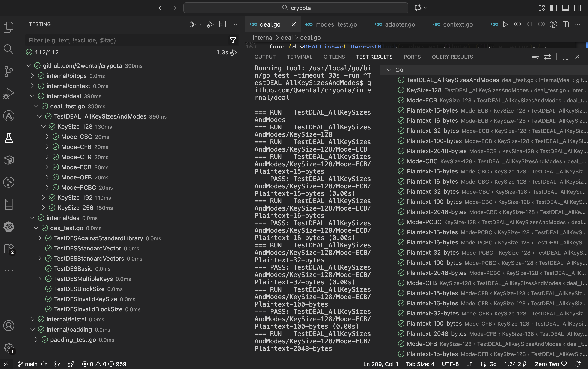

## ЛР1
### task 1
- `internal/bitops/permutation.go` - функция перестановки битов с поддержкой различных правил индексирования

### task 2
- `internal/interfaces/cipher.go` - интерфейс BlockCipher для симметричного шифрования
- `internal/context/context.go` - контекст выполнения криптографических операций
- `internal/padding/padding.go` - режимы набивки (Zeros, ANSI X.923, PKCS7, ISO 10126)
- `internal/modes/modes.go` - режимы шифрования (ECB, CBC, PCBC, CFB, OFB, CTR, Random Delta)

### task 3
- `internal/feistel/feistel.go` - реализация сети Фейстеля

### task 4
- `internal/des/des.go` - основная реализация DES
- `internal/des/keygen.go` - генерация раундовых ключей
- `internal/des/round.go` - раундовая функция
- `internal/des/tables.go` - таблицы перестановок и S-блоки
- `internal/des/des_test.go` - тесты DES

### task 5 и 7
- `cmd/crypota/demonstration_DES_DEAL.go` - демонстрация шифрования файлов DES + в тестах есть демонстрация работы

### task 6
- `internal/deal/deal.go` - реализация DEAL (128/192/256 бит)
- `internal/deal/adapter.go` - адаптер DES для использования в DEAL
- `internal/deal/deal_test.go` - тесты DEAL

